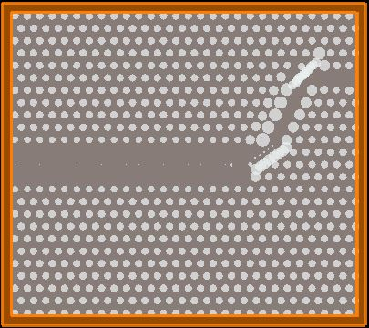
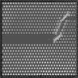

# photonic-crystal-gan

GAN-based generative pipeline for silicon photonic crystal image synthesis using PyTorch.

The goal is to generate photonic crystal structure images from random noise that are close enough to real Lumerical FDTD simulation outputs to be useful — generated images are passed to a Lumerical FDTD simulator where light transmission efficiency is evaluated. Structures clearing a >=75% accuracy threshold are reinjected into the training dataset to iteratively improve generation quality, with a target of 80%+.

The dataset is 34 custom Lumerical FDTD simulation images. This is a hard constraint — standard GAN training assumes thousands of images. Every architectural and training decision in this repo is a direct response to that constraint.

---

## Architecture Progression

Each stage was motivated by a specific diagnosed failure mode in the previous one. This is not a linear tutorial — it is a record of what actually happened.

| Stage | Folder | Architecture | Key Result |
|---|---|---|---|
| 1 | `DCGAN_STAGE_1` | DCGAN (paper-spec, 20×20) | Partial mode collapse. Binary output collapsed to single structure. Blurry continuous output. 20×20 resolution too low for structural fidelity. |
| 2 | `STABILIZED_DCGAN` | DCGAN with stabilisation techniques | Nash equilibrium (~0.693) achieved. Periodic hole lattice and waveguide defect channel topology learned. Blurry and low contrast — DCGAN's distribution-matching ceiling. |

---

## Current State

Active research. `STABILIZED_DCGAN` is the most advanced stage currently in this repo. WGAN-GP experiments (baseline and tuned 256×256) are in progress and will be added back as they're finalized, with the goal of producing outputs that pass the >=75% Lumerical FDTD transmission efficiency threshold consistently.

---

## Folder Structure

```
ai-photonic-design-optimization/
├── README.md
└── photonic-crystal-main/
    ├── DCGAN_STAGE_1/        # Stage 1 — DCGAN, paper-spec 20×20
    ├── STABILIZED_DCGAN/     # Stage 2 — stabilised DCGAN, 128×128 (current best)
    ├── assets/               # Reference/training-data images
    └── pixel_mapping/        # Validation — silicon hole diameter measurement
```

---

## Dataset

34 grayscale photonic crystal images from Lumerical FDTD simulations (custom, not publicly available). Resized and normalized to [-1, 1] for training. Images show periodic silicon-air hole lattice structures with a waveguide defect channel.

---

## Stack

Python, PyTorch, torchvision, OpenCV, TensorBoard, Matplotlib, PIL

---

## Validation Utility

### `pixel_mapping/` — Silicon Hole Diameter Measurement

A standalone utility for measuring silicon hole diameter in pixels and nanometres from a cropped photonic crystal image. Used to compare hole geometry between the highest-accuracy real Lumerical FDTD image and GAN-generated outputs — the junction area (60-degree waveguide bend) is specifically targeted as the most physically critical region.

See `pixel_mapping/README.md` for full details.

---

## Visual Progression

### Real Photonic Crystal — Training Data


A sample from the 34-image Lumerical FDTD dataset. The target structure: periodic silicon-air hole lattice with a diagonal waveguide defect channel. This is what the GAN is learning to generate from random noise.

---

### Stabilized DCGAN — 128×128


Topology learned. Periodic lattice and waveguide defect channel visible. Blurry and low contrast — DCGAN's ceiling with 34 images. Current best result in this repo.
