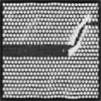

# V0 WGAN-GP — Photonic Crystal

First WGAN-GP implementation on the photonic crystal dataset. Same 128×128 resolution as the stabilised DCGAN but with Wasserstein loss, gradient penalty, and a redesigned Critic.

---

## Why WGAN-GP

The stabilised DCGAN learned topology but outputs were blurry and low contrast. The root cause is BCEWithLogitsLoss — it gives the Generator vanishing gradients once the Discriminator becomes confident, which prevents G from refining fine detail.

Wasserstein loss fixes this. Instead of classifying real vs. fake, the Critic outputs an unbounded scalar score representing "how real" an image is. The Generator is trained to maximise this score. Gradients are meaningful even when the Critic is winning — which means G can keep improving past the point where DCGAN stalls.

Gradient penalty enforces the Lipschitz constraint on the Critic (required for valid Wasserstein distance computation) without weight clipping, which causes its own training instabilities.

---

## Key Architecture Changes from Stabilized DCGAN

| Change | Reason |
|---|---|
| BCEWithLogitsLoss -> Wasserstein loss | Smoother gradients, G can improve past DCGAN's ceiling |
| Discriminator -> Critic (no Sigmoid at output) | Critic outputs unbounded score, not probability |
| BatchNorm removed from Critic | BatchNorm ties batch statistics, unstable under WGAN's multi-step Critic updates |
| InstanceNorm2d added to Critic | Per-image normalisation, stable under WGAN training procedure |
| spectral_norm removed from Critic | Gradient penalty already enforces Lipschitz — two mechanisms conflict |
| Gradient penalty (lambda=10) added | Enforces Lipschitz constraint via penalising gradient norm at interpolated points |
| Critic trained 5x per Generator update | Critic needs to near-convergence before G update for valid Wasserstein estimate |
| Adam betas: (0.5, 0.999) -> (0.0, 0.9) | Standard for WGAN-GP — removes momentum bias from Critic updates |
| GaussianBlur + equalizeHist preprocessing | Attempted to improve training image quality — later removed in V3 |

---

## Architecture

### Generator
Identical to Stabilized DCGAN Generator. ConvTranspose2d blocks with BatchNorm2d and ReLU, Tanh output at 128×128.

### Critic
Input: (1, 128, 128)

```
Conv2d:  1 ->  32, 4x4, stride 2 | LeakyReLU(0.2)
Conv2d: 32 ->  64, 4x4, stride 2 | InstanceNorm2d | LeakyReLU(0.2)
Conv2d: 64 -> 128, 4x4, stride 2 | InstanceNorm2d | LeakyReLU(0.2)
Conv2d:128 -> 256, 4x4, stride 2 | InstanceNorm2d | LeakyReLU(0.2)
Conv2d:256 ->   1, 4x4, stride 1
Output: scalar (no Sigmoid)
```

---

## Training Config

| Hyperparameter | Value |
|---|---|
| Image size | 128×128 |
| Channels | 1 (grayscale) |
| NOISE_DIM | 128 |
| BATCH_SIZE | 8 |
| EPOCHS | 200 |
| LR | 1e-4 |
| FEATURE_GEN / FEATURE_CRITIC | 32 |
| Optimizer | Adam, betas=(0.0, 0.9) |
| CRITIC_ITERATIONS | 5 |
| LAMBDA_GP | 10 |
| Preprocessing | GaussianBlur(3,3) + equalizeHist |

---

## Results

Significant improvement over the stabilised DCGAN. Generated images show:
- Sharp, well-defined circular holes across the periodic lattice
- Strong contrast between holes and background — immediately better than DCGAN
- Waveguide defect channel clearly visible as a diagonal band through the lattice
- Consistent lattice structure across most of the image

Some noise present and lattice uniformity breaks down slightly toward the edges, but the core structure is substantially closer to the real dataset than anything the DCGAN produced.

-> Motivated resolution upgrade and preprocessing cleanup in V3.



---

## What This Motivates

The contrast improvement confirms Wasserstein loss is working — G is getting better gradients and improving past DCGAN's ceiling. The noise problem points to preprocessing: blurring and histogram equalisation on training images creates a distribution that doesn't match what we actually want G to learn.

V3 removes GaussianBlur and equalizeHist entirely, uses clean Lanczos4 resize only, bumps resolution to 256×256, and lowers LR for more stable training at higher resolution.

-> See `V3_WGAN-GP/` for the current best result.
