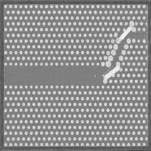

# V3 WGAN-GP — Photonic Crystal

Tuned WGAN-GP at 256×256 resolution. Current best result in the progression. Produces the sharpest hole geometry and most uniform periodic lattice structure achieved so far on the 34-image dataset.

---

## What Changed from V0

V0 established that Wasserstein loss improves contrast significantly over DCGAN. The remaining problems were noise and resolution. This version addresses both.

| Change | Reason |
|---|---|
| Resolution: 128×128 -> 256×256 | Higher resolution captures finer lattice geometry |
| GaussianBlur removed | Was smoothing training images, causing G to learn a blurred distribution |
| equalizeHist removed | Artificial contrast boost did not transfer cleanly to generated outputs |
| Lanczos4 resize only | High-quality interpolation, no artificial modification of training images |
| LR: 1e-4 -> 5e-5 | More conservative LR for stable training at higher resolution |
| BATCH_SIZE: 8 -> 4 | Required for 256×256 on available GPU memory |
| Generator: 6 blocks -> 7 blocks | Extra upsampling block to reach 256×256 (1x1 -> 256×256) |
| Critic: 5 blocks -> 6 blocks | Extra downsampling block to match 256×256 input |
| InstanceNorm2d affine=True | Learnable scale and shift parameters added to Critic normalisation |
| Checkpoint saving | Save best Critic loss every 10 epochs |

---

## Architecture

### Generator
Input: noise vector (NOISE_DIM=128), reshaped to (batch, 128, 1, 1)

```
ConvTranspose2d: 128->1024, 4x4, stride 1 | BatchNorm2d | ReLU   # 1x1   -> 4x4
ConvTranspose2d: 1024->512, 4x4, stride 2 | BatchNorm2d | ReLU   # 4x4   -> 8x8
ConvTranspose2d:  512->256, 4x4, stride 2 | BatchNorm2d | ReLU   # 8x8   -> 16x16
ConvTranspose2d:  256->128, 4x4, stride 2 | BatchNorm2d | ReLU   # 16x16 -> 32x32
ConvTranspose2d:  128-> 64, 4x4, stride 2 | BatchNorm2d | ReLU   # 32x32 -> 64x64
ConvTranspose2d:   64-> 32, 4x4, stride 2 | BatchNorm2d | ReLU   # 64x64 -> 128x128
ConvTranspose2d:   32->  1, 4x4, stride 2 | Tanh                 # 128x128 -> 256x256
Output: (1, 256, 256)
```

### Critic
Input: (1, 256, 256)

```
Conv2d:   1->  32, 4x4, stride 2 | LeakyReLU(0.2)                        # 256 -> 128
Conv2d:  32->  64, 4x4, stride 2 | InstanceNorm2d(affine=True) | LeakyReLU(0.2)  # 128 -> 64
Conv2d:  64-> 128, 4x4, stride 2 | InstanceNorm2d(affine=True) | LeakyReLU(0.2)  #  64 -> 32
Conv2d: 128-> 256, 4x4, stride 2 | InstanceNorm2d(affine=True) | LeakyReLU(0.2)  #  32 -> 16
Conv2d: 256-> 512, 4x4, stride 2 | InstanceNorm2d(affine=True) | LeakyReLU(0.2)  #  16 -> 8
Conv2d: 512->1024, 4x4, stride 2 | InstanceNorm2d(affine=True) | LeakyReLU(0.2)  #   8 -> 4
Conv2d:1024->   1, 4x4, stride 1                                          #   4 -> 1
Output: scalar (no Sigmoid)
```

---

## Training Config

| Hyperparameter | Value |
|---|---|
| Image size | 256×256 |
| Channels | 1 (grayscale) |
| NOISE_DIM | 128 |
| BATCH_SIZE | 4 |
| EPOCHS | 300 |
| LR | 5e-5 |
| FEATURE_GEN / FEATURE_CRITIC | 32 |
| Optimizer | Adam, betas=(0.0, 0.9) |
| CRITIC_ITER | 5 |
| LAMBDA_GP | 10 |
| Preprocessing | Lanczos4 resize to 256×256, normalize to [-1, 1] |

---

## Results

Best output in the progression. Generated images show:
- Sharp, clearly defined circular holes in the periodic lattice
- Consistent hole size and spacing across the image
- Waveguide defect channel (diagonal line of missing/modified holes) clearly visible
- Higher contrast and less noise than V0

Gap from real images still exists — hole edges are not as crisp as the Lumerical FDTD originals, and lattice uniformity degrades slightly at image corners. Research is ongoing.



---

## Current Status

Active. This is the best result achieved so far. The pipeline is being further tuned with the goal of producing outputs that pass the >=75% Lumerical FDTD light transmission efficiency threshold consistently, building toward a target of 80%+.
