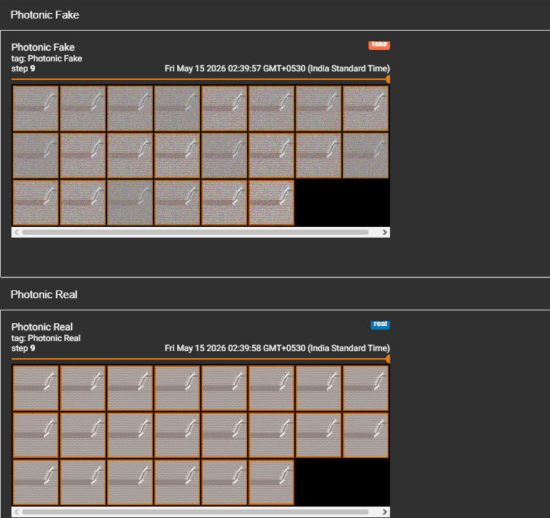

# Vanilla GAN — Photonic Crystal

A fully connected GAN baseline trained on 22 custom photonic crystal images using PyTorch.

Stage 1 of the architecture progression: Vanilla GAN → DCGAN → Stabilised DCGAN → WGAN-GP. Built to establish a baseline and document why fully connected architectures fail on spatially structured image data before moving to convolutional models.

---

## Background

Photonic crystals are periodic nanostructures that control the flow of light. This stage applies a Vanilla GAN to a custom dataset of 22 photonic crystal images to test whether a fully connected architecture can learn and reproduce their geometric structure.

---

## Results

### Mode Collapse — Final Output

G collapsed to producing near-identical outputs across all 22 fixed noise vectors by the final epoch. All generated images converged to the same averaged texture with no structural variation.



**Loss D: ~0.005 — Loss G: ~8.5** — D completely dominated, G stopped exploring.

This is expected behaviour for a fully connected GAN on 22 images with no spatial awareness.

---

## Why This Fails and Why DCGAN is Next

| Problem | Cause | DCGAN Fix |
|---|---|---|
| Mode collapse | No BatchNorm, D dominates immediately | BatchNorm stabilises adversarial balance |
| No spatial understanding | Linear layers flatten pixel relationships | Conv2d layers preserve spatial structure |
| Dataset too small for FC | 22 images, no regularisation | Convolutional layers generalise better with less data |
| All outputs identical | G memorises one output | Strided Conv2d + BatchNorm prevents this |

Vanilla GAN treats a 64×64 image as a flat 4096-dim vector — all spatial relationships between pixels are destroyed. Photonic crystal images have precise geometric structure (periodic hole lattice, waveguide defect channel) that only convolutional layers can capture.

-> See `DCGAN_STAGE_1/` for the next stage.

---

## Architecture

### Discriminator
Input: 4096 (64×64×1 flattened, grayscale)

```
Linear(4096 -> 512) | LeakyReLU(0.2)
Linear(512  -> 256) | LeakyReLU(0.2)
Linear(256  ->   1) | Sigmoid
```

### Generator
Input: z_dim = 100 (random noise vector)

```
Linear(100  -> 256) | LeakyReLU(0.2)
Linear(256  -> 512) | LeakyReLU(0.2)
Linear(512  -> 4096) | Tanh
Output reshaped to (1, 64, 64)
```

---

## Training Config

| Hyperparameter | Value |
|---|---|
| Epochs | 1000 |
| Batch size | 22 (full dataset) |
| NOISE_DIM | 100 |
| Learning rate | 2e-4 |
| Optimizer | Adam |
| Loss | BCELoss |
| Image size | 64×64 |
| Channels | 1 (grayscale) |

---

## Dataset

22 photonic crystal images (custom, not publicly available). Resized to 64×64 and normalised to [-1, 1].

---

## Stack

Python, PyTorch, torchvision, TensorBoard, PIL, Matplotlib
